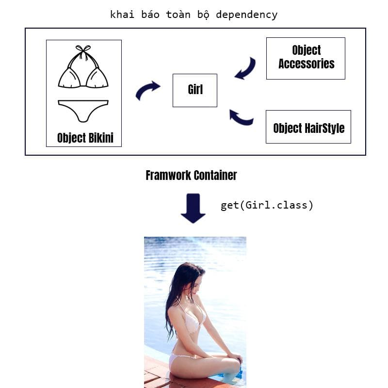

## Tight-coupling

"Liên kết ràng buộc" là một khái niệm trong Java ám chỉ việc mối quan hệ giữa các Class quá chặt chẽ. Khi yêu cầu thay
đổi logic hay một class bị lỗi sẽ dẫn tới ảnh hưởng tới toàn bộ các Class khác.

## Lossely-coupled

là cách ám chỉ việc giảm bớt sự phụ thuộc giữa các Class với nhau

public interface SortAlgorithm {
/**
* Sắp xếp mảng đầu vào
* @param array
*/
public void sort(int array[]);
}

```java
public interface SortAlgorithm {
    public void sort(int array[]);
}

public class BubbleSortAlgorithm implements SortAlgorithm {
    @Override
    public void sort(int[] array) {
        System.out.println("Đã sắp xếp bằng thuật toán sx nổi bọt");
    }
}

public class QuicksortAlgorithm implements SortAlgorithm {
    @Override
    public void sort(int[] array) {
        System.out.println("Đã sắp xếp bằng thuật sx nhanh");
    }
}

public class VeryComplexService {
    private SortAlgorithm sortAlgorithm;

    public VeryComplexService(SortAlgorithm sortAlgorithm) {
        this.sortAlgorithm = sortAlgorithm;
    }

    public void complexBusiness(int array[]) {
        sortAlgorithm.sort(array);
    }
}

public static void main(String[] args) {
    SortAlgorithm bubbleSortAlgorithm = new BubbleSortAlgorithm();
    SortAlgorithm quickSortAlgorithm = new QuicksortAlgorithm();
    VeryComplexService business1 = new VeryComplexService(bubbleSortAlgorithm);
    VeryComplexService business2 = new VeryComplexService(quickSortAlgorithm);
}
```

## Dependency Injection (DI)

Nó là một phương pháp lập trình, là một thiết kế để bạn có được hiệu quả cao hơn khi code.

Nguyên tắc là:
> Các Class không nên phụ thuộc vào các kế thừa cấp thấp, mà nên phụ thuộc vào Abstraction (lớp trừu tượng).

```java
// Một interface cho việc ăn mặc
public interface Outfit {
    public void wear();
}

// Một Class cấp thấp, implement của Outfits
public class Bikini implements Outfit {
    public void wear() {
        System.out.println("Đã mặc Bikini");
    }
}

// Bây giờ Girl chỉ phụ thuộc vào Outfit. nếu muốn thay đổi đồ của cô gái, chúng ta chỉ cần cho Outfit một thể hiện mới.
public class Girl {
    private Outfit outfit;

    public Girl(Outfit anything) {
        this.outfit = anything;
    }
}

public void Main{

public static void main(String[] args) {
    Outfit bikini = new Bikini();
    Girl nhuy = new Gỉrl(bikini);
}
}
```

Khái niệm Dependency Injection từ đây mà ra
> Dependency Injection là việc các Object nên phụ thuộc vào các Abstract Class và thể hiện chi tiết của nó sẽ được
> Inject vào đối tượng lúc runtime.

Các cách để Inject dependency vào một đối tượng có thể kể đến như sau:

- Constructor Injection.
- Setter Injection.
- Interface Injection: Mỗi Class muốn inject cái gì, thì phải implement một Interface có chứa một hàm inject(xx) (Gần
  như thay thế cho setter ý bạn). Rồi bạn muốn inject gì đó thì gọi cái hàm inject(xx) ra. Cách này hơi dài và khó cho
  người mới.

## Inversion of Control

Dependency Injection giúp chúng ta dễ dàng mở rộng code và giảm sự phụ thuộc giữa các dependency với nhau.
Tuy nhiên khi một Class có hàng chục dependency thì sẽ phải inject từng cái.

```java
public static void main(String[] args) {
    Outfit bikini = new Bikini();
    Accessories gucci = new GucciAccessories();
    HairStyle hair = new KoreanHairStyle();
    Girl ngocTrinh = new Girl(bikini, gucci, hair);
}
```

Từ đây framework ra đời để giải quyết vấn đề định nghĩa trước tất dependency có trong project, và inject vào đối tượng
cần dependency
> Inversion of Control is a programming principle. flow of control within the application is not controlled by the
> application itself, but rather by the underlying framework.

